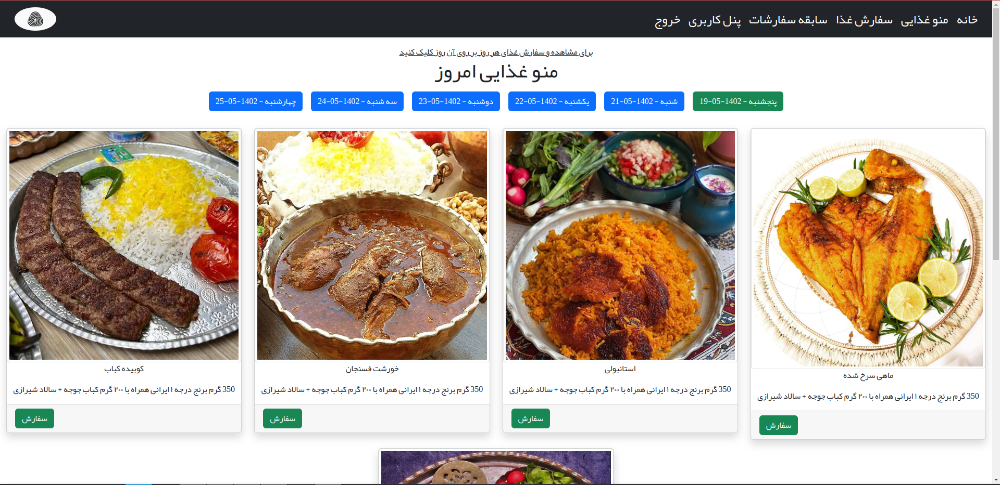

# اتوماسیون تغذیه کارمندان
### سیستم اتوماسیون تغذیه یا سلف سرویس در واقع یک نوع از سیستم جامع تحویل غذا است که پرسنل و دانشجویان می توانند به منظور سفارش و صرف غذا در سازمان های دولتی و خصوصی و همچنین دانشگاه ها از این سیستم استفاده کنند.

  
  
  
  
  
  
  

Tech Stack:
      
      python3
          jinja2
          sms_ir-python
          requests
          Khayyam
      Flask
        Flask-Captcha2
        Flask-Sqlalchemy
        Flask-Session
        Flask-Wtf
        Flask-Migrate
        Flask-RQ
        Flask-Mail
      Redis 
      Mysql
        PyMySQL
      Html
      Css
          Bootstrap 5.2
          Bootstrap Icon 1.10
      Javascript
          Chart js
          Moment js
          SweetAlert2 js
          Jquery js
          PersianDatePicker js
          
        

### Persian Version of readme <a href="./docs/HELP-FA.md">Click</a>
## virtual environment:

      Python3 -m venv venv
      or 
      python -m vevn venv

## activate:

      source ./venv/bin/active
      or
      .\venv\Scripts\activate.bat

## Install dependencies:

      pip install -r requirements.txt
      

## Configurations and Settings:
- before starting the app, you should do some steps
- first create your own config file with below command:
 
      cp .env.sample .env
- then open the .env file and fill in all the required fields 
- the required files include the database configuration, admin configuration, and SecretKey

- after these steps you have to run below commands for SMS_IR config file

        cp FoodyConfig/StaticConfig/SMS_IR_Config.py.sample FoodyConfig/StaticConfig/SMS_IR_Config.py
- and then open FoodyConfig/StaticConfig/SMS_IR_Config.py and replace your template id (FROM SMS_IR) with fake one in file

- then init and migrate db with below commands:
        
        # remember at this poit you should create a database 
        # and also put database name in .env file before running below commands
          
        flask db init
        flask db migrate
        flask db upgrade

- to change the sections, simply open FoodyConfig/StaticConfig/Sections.py and replace all Sections with your own Company Sections (this required a little bit knowledge of Python Dict )
- one last command is init settings:
      
        flask create init_setting
- this command update database with setting file

- simply run the following command :

        flask run [--port int:portNumber] [--debug] [ --reload ] [-- with-threads OR --without-threads]
        or 
        python app.py

## create superuser account:
for creating admin Account go to root of project and run below commands :
      
      flask create superuser [--help]

## Admin Panel
For the admin panel URL, there is a key in the .env file called ADMIN_LOGIN_TOKEN. You should remember that token because you have to pass that token to a special endpoint every time you want to log in to the admin panel.

### Admin Login URL:

- www.domain.tld/auth/admin/login/<token>
- 127.0.0.1:8000/auth/admin/login/<token>

### Default Token:
The default token is 123654. So, the admin URL login with the default token is:

- www.domain.tld/auth/admin/login/123654
- 127.0.0.1:8000/auth/admin/login/123654

## Nginx Config:
When the application is running with Debug=True (APP-DEBUG property in the .env file), the application itself serves static files locally. However, when the debug mode is set to False, the application no longer serves static files, and Nginx serves them for you. Therefore, if the app's debug mode is set to False, you need to create a reverse proxy and add some configuration to your web server so that the app can render static files correctly. 

## liara deploy:
this web application configure for deploying to liara.ir
if you want to use another pass Service provider make sure, to change nginx config

## liara Disk:
this app required a disk Volume to save images food 

for this app configure to point to a disk called #Media 

so don't forget to create a Disk for this (recommended size: 1G)

## CLI Commands :

### - create cli:
    flask create init_setting [--help]
this command is super important because this command insert all sections,days in database  
when ever you add new item to sections you have to run this command

    flask create superuser [--help]
Use this command for adding new admin to database

    flask create fakeuser [--help]
adding Fake users to app [for development purpose]

### - status cli:

    flask status users [--help]
this command show you information about users in app (all users, active users, ...)
  

    flask status admins [--help]

this command show you information abut admins in app (all admins, active admins, ...)

    flask status orders [--help]

this command show you information abot orders (all orders, today orders, ...)
    
    

### Admin Panel

### User Panel

# Responsive

